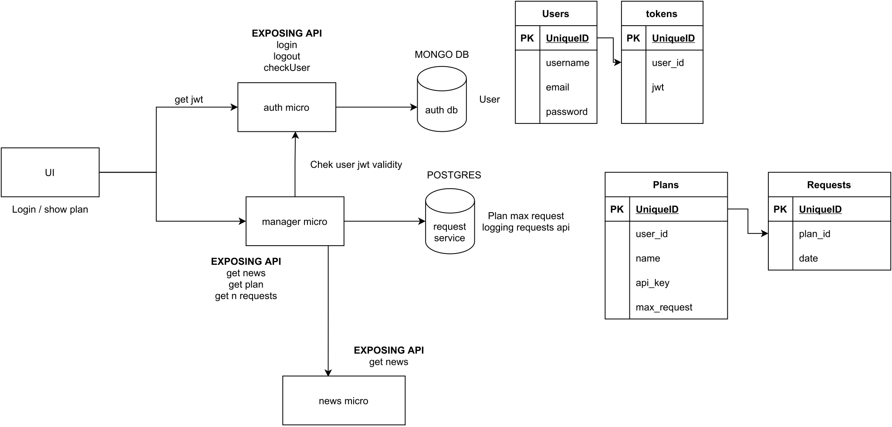

# API MANAGER
An API platform.

### Project requirements
Goal: creation of a cloud-native microservices application
- At least three REST microservices or at least two microservices and one FaaS
- At least one external API must be used (there are several, weather, twitter, etc.)
- At least two different databases (besides the microservices) 
  - Ex. MongoDB, MySQL, ...
- At least one microservice pattern

### Summary

### Credits

| [ <b>derogab</b>](https://github.com/derogab) | [ <b>ruggero95</b>](https://github.com/ruggero95) | 
| :---: | :---: |
