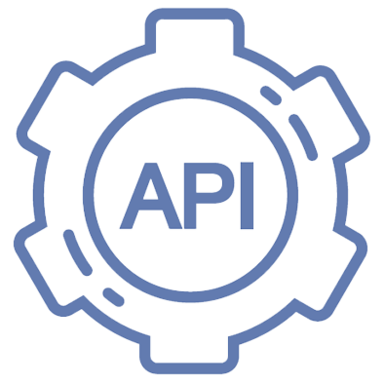

  

<h1 align="center">API MANAGER</h1>
<h3 align="center">A simple API platform. With NEWS API DEMO.</h3>

    

### Project requirements
Goal: creation of a cloud-native microservices application
- At least three REST microservices or at least two microservices and one FaaS
- At least one external API must be used (there are several, weather, twitter, etc.)
- At least two different databases (besides the microservices) 
  - Ex. MongoDB, MySQL, ...
- At least one microservice pattern

### Summary
API Manager is **a simple API platform**.  
You can log in and create an api plan. With the generated API KEY, it will be possible to make requests to the api to get some news.

### Architecture

### Credits
| [ <b>derogab</b>](https://github.com/derogab) | [ <b>ruggero95</b>](https://github.com/ruggero95) | 
| :---: | :---: |
